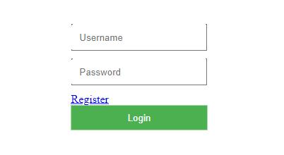
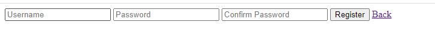
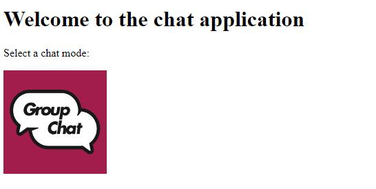
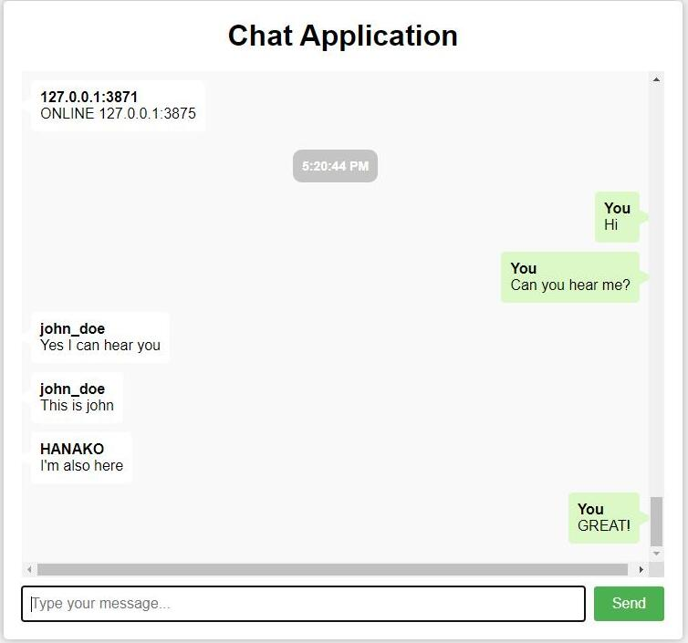
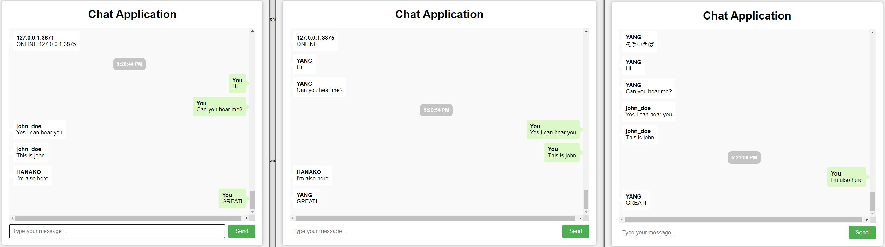

# ChatApplication-Go
This project adopted following languages:<br>
`Golang` (backend), `HTML+JavaScript+CSS` (frontend), `MySQL` (database) <br>
And Following technologies:<br>
`Ajax` (Frontend to backend), `Websocket` (Backend to Frontend) <br>

## Update
[2023/04/09] First time released to public <br>
[2023/05/06] Docker compilation added

## Usage
### Navigate to Login Page
Once application compiled and executed correctly (following Implementation Details section), we can check the hint message to navigate to login page for application as follows:
```bash
Starting client on port:  5555
Visit Page on: http://localhost:5555/
Starting client on port:  7777
Visit Page on: http://localhost:7777/
```
Following the message to visit the page to the login page. In Docker, there are two clients are initialized for users to login where the pages are on `http://localhost:5555/` and `http://localhost:7777/`.
### Login
Before go to chat page, we need to first login. we can also register new account clicking `register` button.<br>
Notice that there are some initial accounts for us to login (also can be checked in sql scripts):

| Username  | Password | <br>
| -------- | -------- | -------- |
| admin | admin |
| john_doe | password123 |
| jane_doe | password456 | 

### Navigate to Chat Page
In homepage, click `Group Chat` mode to navigate to chat page. Now you can chat!
# Implementation Details
## Compile with Docker
In the root where `docker-compose.yml` file exists, excute following command to launch chat application:
```bash
docker-compose up 
```
This will automatically pull the existing images on DockerHub. <br>
You can also build your own images by editing `docker-compose.yml` file. First comment following codes:
```yaml
    L13: image: gracesta/chatapp-go-server
    L18: image: gracesta/chatapp-go-client
```
And uncomment following lines to build your own images:
```yaml
    # build: ./server
    # build: .
```
## Compile Locally
### Setup for Your Database
1. Edit `config.yaml` in root in the format below (Note that it's different forom that for Docker):
```yaml
db:
  host: localhost
  port: YOUR_PORT_NUMBER
  user: USER_NAME
  password: YOUR_PASSWORD
  name: DATABASE_NAME
```
2. Navigate to `./scripts/` and excute `createDatabase_chatApp.sql` and `createSamples_chatApp.sql` to set up your database (MySQL)

3. Install all the dependencies:
```bash
go get "github.com/go-sql-driver/mysql"
go get "github.com/gorilla/websocket"
go get "gopkg.in/yaml.v2"
```

### Launch Server
Navigate to `./server` directory, run the command below:
```bash
go run main.go server.go user.go
```
### Launch Client
```bash
go run client.go handlerDatabase.go
```

Finally navigate to the showed page to login (e.g.):
```bash
Visit Page on: http://localhost:XXXX/
```

## Demo

### Login Page


### Register Page


### Homepage (Only Public chat mode to select now)


### Group Chat Page




